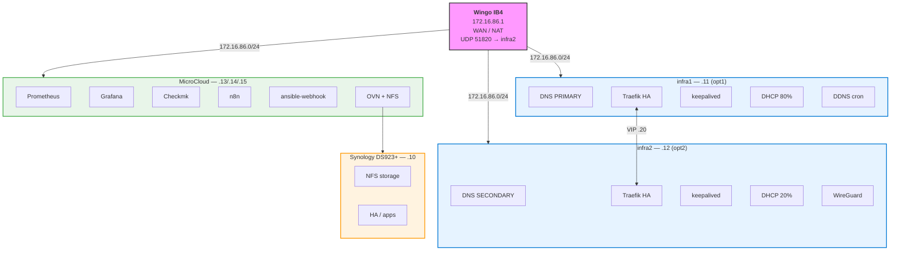
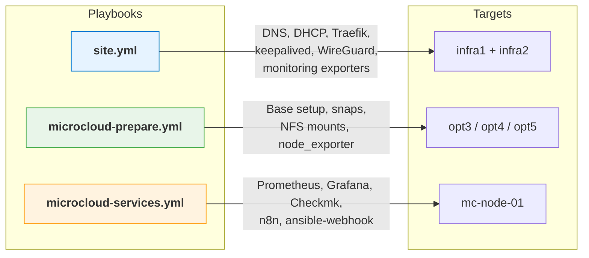
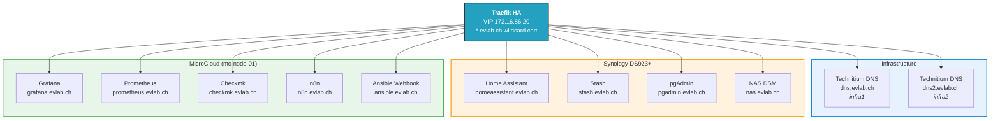
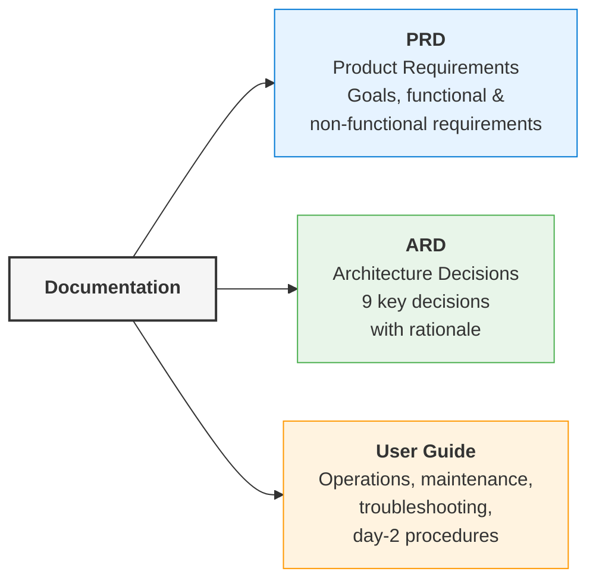

# homelab-dns

[](https://github.com/fjacquet/homelab-dns/actions/workflows/lint.yml)
[](https://github.com/fjacquet/homelab-dns/actions/workflows/docs.yml)
[](https://fjacquet.github.io/homelab-dns)


Ansible-automated homelab infrastructure on 5 Dell Optiplex Micro machines: HA DNS, HTTPS reverse proxy with wildcard certs, WireGuard VPN, DHCP, ad blocking, monitoring stack, and event-driven automation via n8n + Ansible webhook engine.

## Architecture



## Quick Start

```bash
# Prerequisites
brew install ansible
ssh-copy-id fjacquet@172.16.86.{11,12,13,14,15}

# Configure secrets
echo 'your-vault-password' > ~/.vault_pass && chmod 600 ~/.vault_pass
ansible-vault edit group_vars/all/vault.yml

# Deploy infrastructure (infra1 + infra2)
ansible-playbook -i inventory.yml site.yml

# Deploy MicroCloud nodes
ansible-playbook -i inventory.yml microcloud-prepare.yml
ssh fjacquet@172.16.86.13 "sudo microcloud init"  # interactive
ansible-playbook -i inventory.yml microcloud-services.yml
```

## Playbooks



### Phase-by-Phase Deployment

```bash
# Infrastructure
ansible-playbook -i inventory.yml site.yml --tags base
ansible-playbook -i inventory.yml site.yml --tags docker
ansible-playbook -i inventory.yml site.yml --tags technitium
ansible-playbook -i inventory.yml site.yml --tags dns_records
ansible-playbook -i inventory.yml site.yml --tags traefik
ansible-playbook -i inventory.yml site.yml --tags keepalived
ansible-playbook -i inventory.yml site.yml --tags iptables
ansible-playbook -i inventory.yml site.yml --tags dhcp
ansible-playbook -i inventory.yml site.yml --tags wireguard
ansible-playbook -i inventory.yml site.yml --tags cron
ansible-playbook -i inventory.yml site.yml --tags monitoring
ansible-playbook -i inventory.yml site.yml --tags verify

# Dry-run
ansible-playbook -i inventory.yml site.yml --check --diff
```

## Services

All services behind Traefik HA (VIP `172.16.86.20`) with Let's Encrypt wildcard cert `*.evlab.ch`.



## Key Design Decisions

- **No Ceph** — NFS from Synology for MicroCloud storage (simple, sufficient for homelab)
- **WireGuard native** — kernel module, not Docker (simpler, more reliable)
- **Technitium in Docker** — no .deb package available, `network_mode: host` for DHCP broadcast
- **keepalived VIP** — sub-10s failover vs DNS round-robin (minutes)
- **Dual monitoring** — Prometheus/Grafana (metrics) + Checkmk (SNMP, auto-discovery, alerting)
- **Event-driven automation** — n8n + FastAPI webhook engine on MicroCloud; n8n calls `POST /run` to trigger any Ansible playbook asynchronously
- **Separate patch playbooks** — `update.yml` (OS + reboot) and `update-containers.yml` (images + node_exporter) run independently

See [Architecture Decision Records](https://fjacquet.github.io/homelab-dns/adr/index/) for full rationale.

## Documentation



## Project Structure

```mermaid
graph TD
    ROOT["<b>homelab-dns/</b>"]

    ROOT --- CFG["ansible.cfg<br/>inventory.yml<br/>.gitignore"]
    ROOT --- PB["<b>Playbooks</b>"]
    ROOT --- GV["<b>group_vars/all/</b>"]
    ROOT --- TPL["<b>templates/</b>"]
    ROOT --- DOC["<b>docs/</b>"]
    ROOT --- TOOLS["<b>tools/</b>"]

    PB --- S["site.yml<br/><i>DNS/HTTPS/VPN/DHCP</i>"]
    PB --- MP["microcloud-prepare.yml<br/><i>Node preparation</i>"]
    PB --- MS["microcloud-services.yml<br/><i>Prometheus/Grafana/Checkmk</i>"]

    GV --- MV["main.yml<br/><i>Variables</i>"]
    GV --- VV["vault.yml<br/><i>Encrypted secrets</i>"]

    TPL --- T1["technitium-compose.yml.j2"]
    TPL --- T2["traefik-*.yml.j2"]
    TPL --- T3["keepalived.conf.j2"]
    TPL --- T4["wg0.conf.j2 / wg-client.conf.j2"]
    TPL --- T5["netplan / ddns / backup .j2"]

    DOC --- D1["PRD.md"]
    DOC --- D2["ARD.md"]
    DOC --- D3["USER-GUIDE.md"]

    TOOLS --- AI["ansible_ai.py<br/><i>AI playbook generator</i>"]

    style ROOT fill:#f5f5f5,stroke:#333,stroke-width:2px
    style PB fill:#e6f3ff,stroke:#0078D4
    style GV fill:#e8f5e9,stroke:#4caf50
    style TPL fill:#fff3e0,stroke:#ff9800
    style DOC fill:#fce4ec,stroke:#e91e63
    style TOOLS fill:#f3e5f5,stroke:#9c27b0
```



## License

MIT
