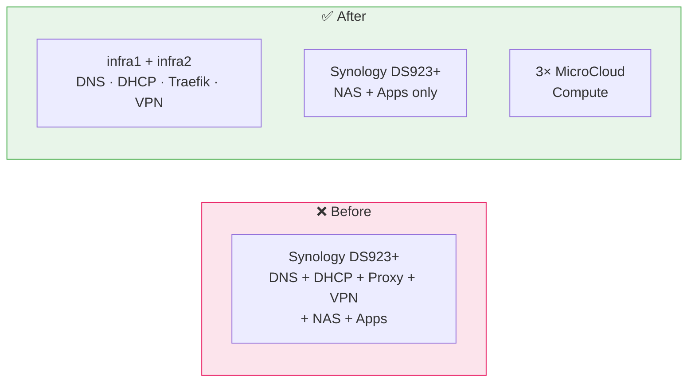

# ADR-001: Dedicated Optiplex Micro for Infrastructure

**Date:** 2026-03-07 | **Status:** ✅ Accepted

## Context

Network services (DNS, DHCP, reverse proxy, VPN) were initially planned on the Synology DS923+ NAS.

## Decision

Dedicate 2 of 5 Optiplex Micro to infrastructure. The Synology reverts to pure NAS.

## Rationale

- Port 53/80/443 conflicts with DSM services
- WireGuard kernel module unavailable on DSM
- `NET_ADMIN` capability unreliable in DSM Container Manager
- Single Point of Failure eliminated — NAS reboot no longer causes total network outage
- 3 remaining Optiplex still sufficient for MicroCloud (minimum 3 for OVN quorum)

## Consequences

- Higher idle power consumption (~30–50W for 2 Optiplex vs Synology alone)
- More hardware to maintain
- +65 CHF/year electricity vs Raspberry Pi alternative (zero hardware cost since already owned)
