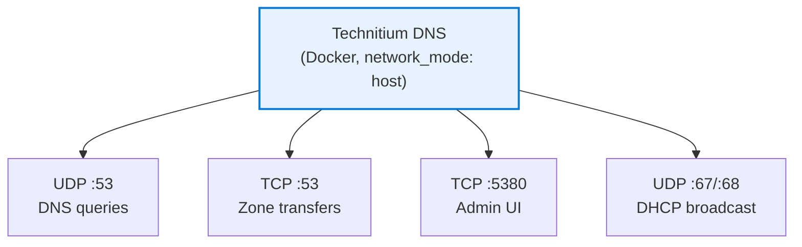

# ADR-002: Technitium DNS in Docker (not native)

**Date:** 2026-03-07 | **Status:** ✅ Accepted

## Context

Technitium DNS Server can run as a .NET application or Docker container.

## Decision

Deploy as Docker container with `network_mode: host`.

## Rationale

- No official .deb package — would require manual .NET runtime installation
- Docker simplifies upgrades and rollbacks
- `network_mode: host` provides full port access (53/UDP, 53/TCP, 5380)
- Built-in DHCP server requires broadcast, which works with host networking
- Consistent with Traefik (also Docker)

## Consequences

- Docker dependency on both infra nodes
- Container restart required for config changes (vs service reload)
- Technitium and Traefik excluded from Watchtower auto-updates (manual)
