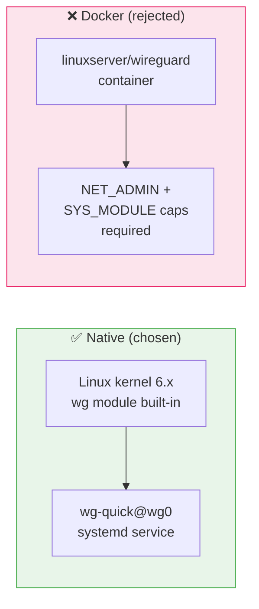

# ADR-003: WireGuard Native (not Docker)

**Date:** 2026-03-07 | **Status:** ✅ Accepted

## Context

WireGuard can run as a Docker container (linuxserver/wireguard) or native kernel module.

## Decision

Deploy WireGuard natively via `apt install wireguard` + `wg-quick` + systemd.

## Rationale

- Linux kernel 6.x includes WireGuard module — no compilation needed
- Native is simpler: no `NET_ADMIN`/`SYS_MODULE` capabilities to manage
- `wg-quick@wg0` systemd service is stable and well-documented
- Fewer moving parts for a critical VPN service
- QR code generation works directly with `qrencode`

## Consequences

- Updates via `apt upgrade` instead of Docker image pull
- Config file at `/etc/wireguard/wg0.conf` (not in Docker volume)
- No Docker Compose for WireGuard — managed separately by Ansible
