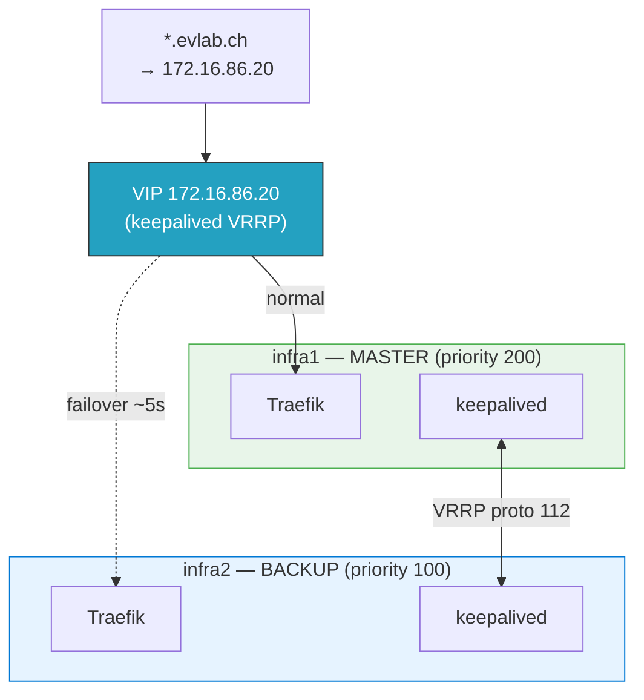

# ADR-004: Traefik HA via keepalived (not DNS round-robin)

**Date:** 2026-03-07 | **Status:** ✅ Accepted

## Context

With Traefik on 2 nodes, we need HA for the reverse proxy.

## Decision

Use keepalived with VRRP to manage a floating VIP (`172.16.86.20`).

## Rationale

- DNS wildcard `*.evlab.ch` points to a single IP — needs to always be reachable
- keepalived failover in ~5 seconds (vs DNS TTL-based failover in minutes)
- VRRP is well-proven for this exact use case
- Health check script verifies Docker container AND HTTP response
- Certificate sync via hourly rsync ensures BACKUP node has valid certs

## Alternatives Considered

- **DNS round-robin**: Both IPs in `*.evlab.ch` — client-dependent behavior, no health check
- **Traefik Swarm/K8s**: Overkill for 2 nodes

## Consequences

- VIP (`172.16.86.20`) must be reserved — not assigned to any physical host
- VRRP protocol 112 must be allowed between infra1 and infra2
- `preempt_delay` of 300s to avoid flapping after infra1 recovery
