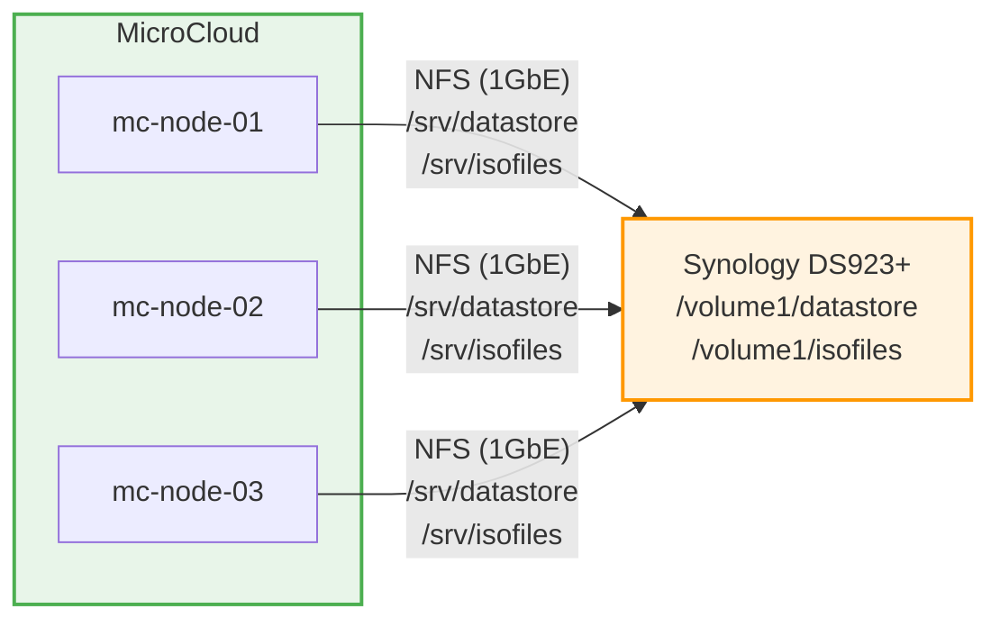

# ADR-005: NFS from Synology (not Ceph)

**Date:** 2026-03-08 | **Status:** ✅ Accepted

## Context

MicroCloud typically uses Ceph for distributed storage across nodes.

## Decision

Use NFS exports from Synology DS923+ instead of Ceph.

## Rationale

- Ceph is overly complex for a 3-node homelab
- Zero fault tolerance with Ceph on 3 nodes (1 node failure = cluster degraded with no re-replication)
- Synology already hosts all persistent data
- NFS is simple, well-understood, zero additional disk requirements
- Two existing NFS exports: `datastore` and `isofiles`

## Alternatives Considered

- **Ceph (MicroCeph)**: Default for MicroCloud — rejected for complexity
- **LINSTOR (DRBD)**: Simpler than Ceph but still requires extra disks
- **iSCSI from Synology**: Better block performance but more complex setup

## Consequences

- Synology is SPOF for MicroCloud storage (acceptable for homelab)
- NFS performance limited by 1 GbE network (32KB packet size)
- Live migration works (all nodes see same NFS storage)
- No data locality — all I/O crosses the network
