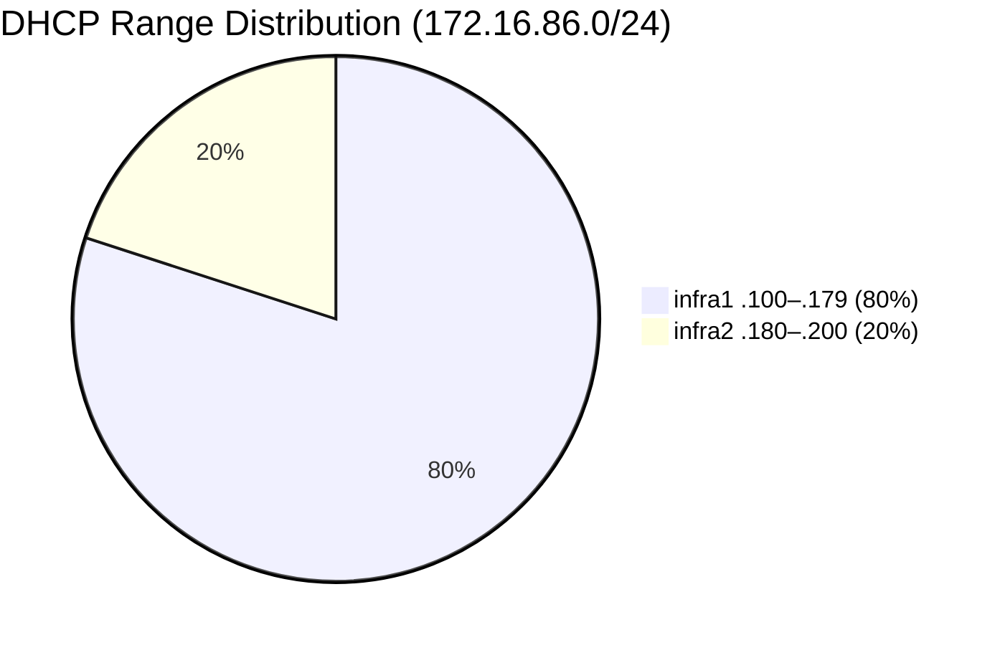

# ADR-006: Split-scope DHCP (not failover)

**Date:** 2026-03-07 | **Status:** ✅ Accepted

## Context

DHCP needs to survive the failure of one infra node. Technitium does not support native DHCP failover/replication.

## Decision

Split-scope: infra1 serves 80% of the range (`.100`–`.179`), infra2 serves 20% (`.180`–`.200`).

## Rationale

- Split-scope is the standard approach for DHCP HA without protocol support
- 80/20 split ensures infra1 handles most leases in normal operation
- Existing clients retain their lease (24h) even if their serving node fails
- All 24 DHCP reservations configured on both nodes (MAC-based, Ansible-managed)

## Consequences

- Clients may get different IPs from different scopes if their primary fails
- DHCP reservations must be maintained on **both** nodes — Ansible ensures this
- 80% range on primary is sufficient for ~24 known + dynamic devices
