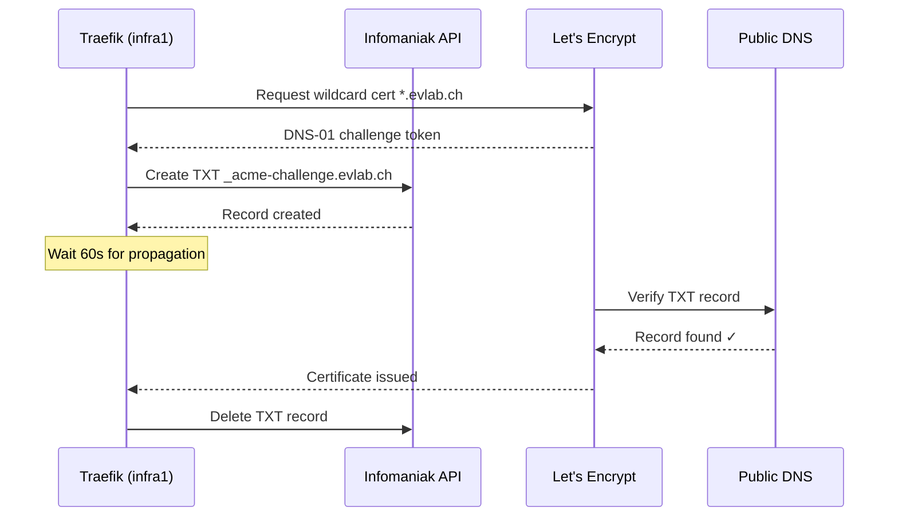

# ADR-007: DNS-01 Challenge via Infomaniak API

**Date:** 2026-03-07 | **Status:** ✅ Accepted

## Context

Let's Encrypt wildcard certificates require DNS-01 challenge validation.

## Decision

Use Infomaniak DNS API for ACME DNS-01 challenge (Traefik built-in provider).

## Rationale

- `evlab.ch` domain managed by Infomaniak — direct API access
- DNS-01 is the only challenge type that supports wildcard certs
- Traefik has native Infomaniak provider support
- No dependency on local Technitium DNS for certificate validation
- Public NS validation avoids any split-horizon issues

## Consequences

- Infomaniak API token required (stored in Ansible Vault)
- Challenge resolution depends on Infomaniak API availability
- 60-second delay before check to allow DNS propagation
