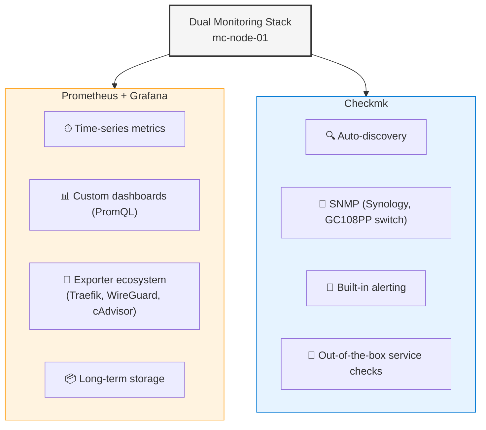

# ADR-008: Dual Monitoring Stack (Prometheus + Checkmk)

**Date:** 2026-03-08 | **Status:** ✅ Accepted

## Context

Infrastructure needs monitoring and alerting.

## Decision

Deploy both Prometheus + Grafana (metrics) and Checkmk (infrastructure monitoring).

## Rationale

Each tool covers gaps in the other:

## Alternatives Considered

- **Prometheus only**: Missing SNMP, complex alerting setup
- **Checkmk only**: Weaker custom dashboards, no native exporter ecosystem
- **Uptime Kuma**: Too simple for 5-node infrastructure

## Consequences

- Higher resource usage on mc-node-01 (Prometheus + Grafana + Checkmk)
- Two UIs to check (mitigated by Traefik providing HTTPS access to both)
- Checkmk agent + node_exporter deployed on all 5 nodes
