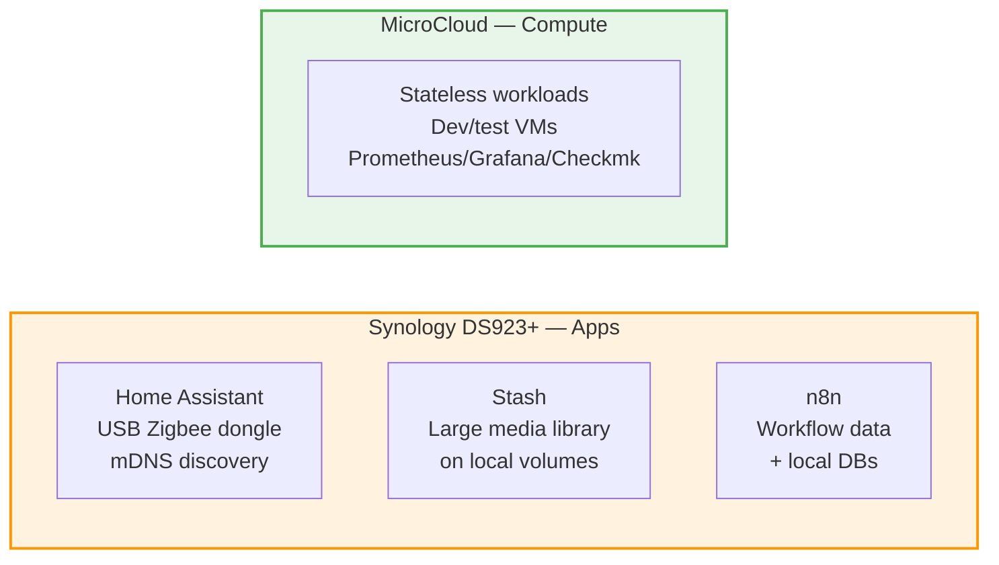

# ADR-009: Application Services Stay on Synology

**Date:** 2026-03-07 | **Status:** ✅ Accepted

## Context

Home Assistant, Stash, n8n could theoretically move to MicroCloud.

## Decision

Keep application services on Synology DS923+.

## Rationale

**Home Assistant:**

- USB dongle passthrough (Zigbee/Z-Wave) trivial on Docker, complex on Incus
- mDNS discovery requires host networking
- Recorder database benefits from local storage
- Must survive MicroCloud maintenance

**Stash:**

- Large media library resides on Synology volumes
- NFS mount would add latency and complexity
- Not a HA-critical service

**n8n:**

- Workflow data on Synology
- Integration with Synology-local databases (pgvector, redis, mongo)

## Consequences

- Synology runs application containers (Watchtower manages updates)
- MicroCloud reserved for stateless workloads, dev/test, VMs
- Clear separation: **Synology = data + apps**, **Optiplex = infrastructure + compute**
