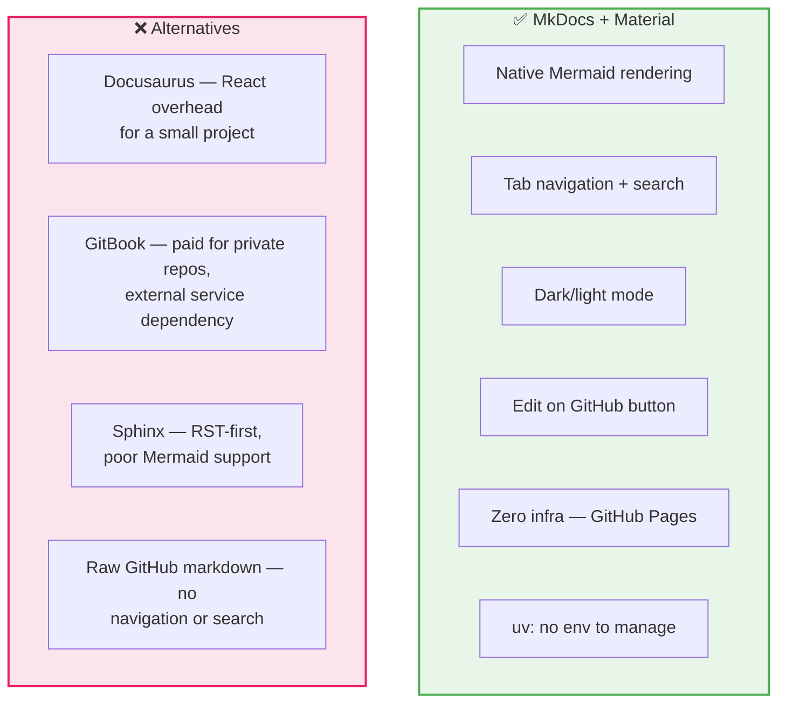
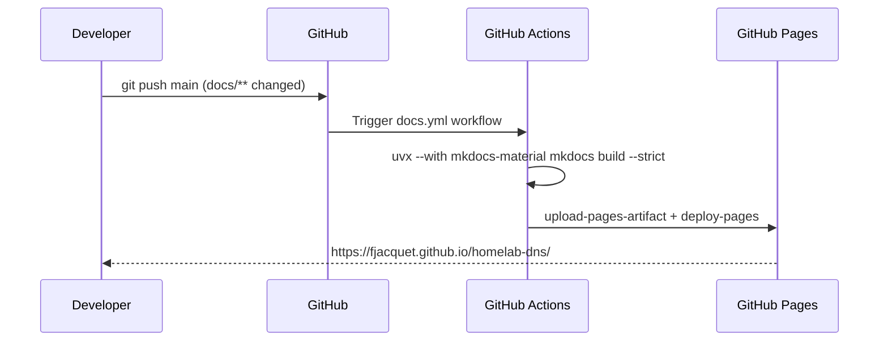

# ADR-010: MkDocs + GitHub Pages for Documentation

**Date:** 2026-03-08 | **Status:** ✅ Accepted

## Context

The project had documentation in three markdown files (`PRD.md`, `ARD.md`, `USER-GUIDE.md`) browsable only as raw GitHub markdown. No navigation, no search, no versioning, no cross-linking between documents.

## Decision

Use **MkDocs** with the **Material theme**, deployed automatically to **GitHub Pages** via GitHub Actions on every push to `main` that touches `docs/**` or `mkdocs.yml`.

## Rationale

## Deployment pipeline

## Consequences

- Docs live at `https://fjacquet.github.io/homelab-dns/` — always in sync with `main`
- `mkdocs build --strict` in CI catches broken links and missing pages at deploy time
- Local preview: `uv run tools/serve-docs.py` (no global installs required)
- `site/` excluded from git via `.gitignore`
