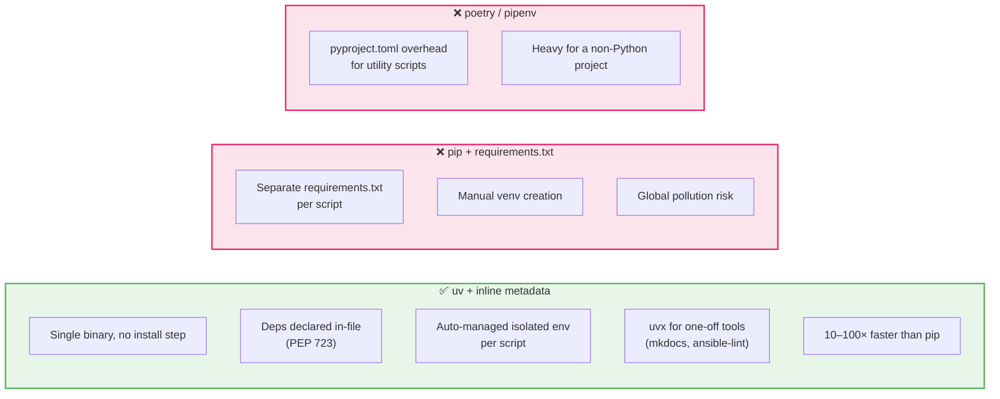

# ADR-012: uv for Python Tooling Scripts

**Date:** 2026-03-08 | **Status:** ✅ Accepted

## Context

The project is Ansible-based with no Python project setup. Two Python tooling scripts were added (`tools/ansible_ai.py` and `tools/serve-docs.py`). A dependency management strategy was needed that required no global installs, no virtual environment setup, and no `requirements.txt` maintenance.

## Decision

Use **uv** with **PEP 723 inline script metadata** (`# /// script`) for all Python tooling scripts. Each script declares its own dependencies in a comment block at the top of the file.

## Rationale



## Script template

Every tooling script follows this pattern:

```python
#!/usr/bin/env -S uv run --script
# /// script
# requires-python = ">=3.11"
# dependencies = [
#     "anthropic>=0.45.0",
# ]
# ///
```

Invocation: `uv run tools/my-script.py [args]` — uv resolves and installs dependencies automatically on first run, then caches them.

## Consequences

- No `requirements.txt`, no `pyproject.toml`, no `venv` directory in the repo
- Any developer with `uv` installed can run any tool with a single command
- `uvx --with mkdocs-material mkdocs build` used in CI (GitHub Actions) — no `pip install` step
- New tooling scripts must follow the inline metadata pattern
