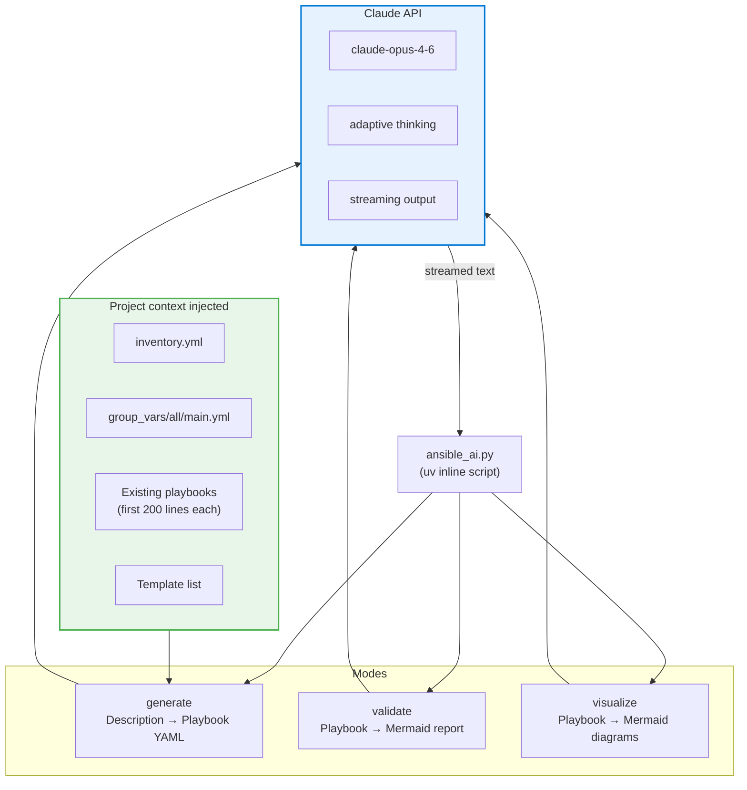

# ADR-013: Claude API for Ansible AI Tooling

**Date:** 2026-03-08 | **Status:** ✅ Accepted

## Context

Managing a complex Ansible codebase (3 playbooks, 876+ lines, 14 templates, Technitium API, Docker Compose, WireGuard, keepalived) creates friction when adding new services or auditing existing playbooks. Manual validation misses subtle issues (missing `no_log`, fragile `changed_when`, hardcoded IPs).

## Decision

Provide a `tools/ansible_ai.py` CLI that uses the **Claude API** (`claude-opus-4-6` with adaptive thinking) for three operations:

- `generate` — produce a new playbook from a natural language description, using the project's existing conventions as context
- `validate` — review a playbook and output a Mermaid-formatted quality/security report
- `visualize` — generate Mermaid diagrams of playbook flow, host targeting, and service dependencies

## Architecture

## Rationale

- **Validate output** surfaces issues (missing `no_log`, `failed_when: false`, hardcoded IPs) as structured Mermaid reports rather than raw text — consistent with ADR-011
- **Generate with context** — feeding inventory, variables, and existing playbooks to Claude ensures generated playbooks match project conventions (FQCN, tags, Docker Compose structure, variable naming)
- **Adaptive thinking** (`thinking: {type: "adaptive"}`) for deep analysis of complex multi-phase playbooks without manual `budget_tokens` tuning
- **Streaming** prevents timeout on large playbook analysis

## Alternatives Considered

- **ansible-lint only** — catches syntax and style but not semantic issues (fragile `changed_when` strings, missing `flush_handlers`)
- **GPT-4 / Gemini** — no project-specific training; switching cost low since the tool abstracts the model
- **Local LLM (Ollama)** — insufficient context window and code quality for 876-line playbook analysis

## Consequences

- Requires `ANTHROPIC_API_KEY` environment variable on the developer's machine
- API costs apply per use (generate/validate calls typically 5–15K input tokens)
- Output is suggestions only — human review required before applying generated playbooks
- The tool is advisory, not part of the CI pipeline
