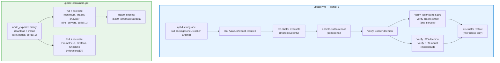

# ADR-014: Separate OS and Container Patch Management Playbooks

**Date:** 2026-03-08 | **Status:** ✅ Accepted

## Context

Patch management across 5 nodes had no dedicated automation path:

- `site.yml` Phase 0 runs `apt upgrade` but only targets `dns_servers` — `microcloud` nodes had no upgrade path
- Container image updates required manual SSH per node (`docker compose pull && docker compose up -d`)
- `node_exporter` (a versioned binary from GitHub) had no update mechanism outside of a full `site.yml` rerun
- Manual patching is error-prone: easy to skip a node, forget a service health check, or reboot without evacuating LXD instances first

The HA constraints of the environment require careful ordering: one node at a time, service health verified before moving to the next.

## Decision

Provide two standalone, idempotent Ansible playbooks:

| Playbook | Scope | Purpose |
|---|---|---|
| `update.yml` | `dns_servers:microcloud` — `serial: 1` | OS packages (apt dist-upgrade), reboot if kernel changed, Docker daemon verification |
| `update-containers.yml` | All nodes (node_exporter) + `dns_servers` + `microcloud[0]` | Container image pulls + recreate, node_exporter binary upgrade |

## Architecture

## Rationale

- **`serial: 1`** — ensures DNS HA and Traefik VIP remain available during upgrades; infra2 serves while infra1 reboots, then vice versa
- **Two playbooks, not one** — OS reboots and container image updates have different risk profiles and different run frequencies. Keeping them separate lets operators run `update-containers.yml` weekly without triggering reboots
- **LXD evacuate/restore** — MicroCloud nodes must migrate LXD instances off before rebooting; a node rebooting without evacuation would drop running workloads
- **`/var/run/reboot-required` check** — standard Ubuntu mechanism (written by `unattended-upgrades`); avoids unnecessary reboots when no kernel update was installed
- **node_exporter in `update-containers.yml`** — it is a versioned binary (not an apt package, not a container); updating it belongs with service-level updates, not OS-level updates. Version is controlled via `node_exporter_version` in `group_vars/all/main.yml`
- **Not part of `site.yml`** — `site.yml` is a deployment playbook (idempotent infrastructure state). Patch management is an operational concern with different semantics (pull latest, restart)

## Alternatives Considered

- **Watchtower** — already explicitly disabled (`com.centurylinklabs.watchtower.enable=false`) for Technitium and Traefik; uncontrolled automatic image updates are unsuitable for HA infrastructure
- **Unattended-upgrades** — handles security patches automatically but cannot coordinate reboots across clustered nodes or verify service health after restart
- **Embed in `site.yml`** — would force operators to rerun the full deployment playbook for routine patching, conflating deployment with maintenance

## Consequences

- Operators run `update.yml` for OS patches and `update-containers.yml` for image/binary updates independently
- To upgrade `node_exporter`, bump `node_exporter_version` in `group_vars/all/main.yml` and run `update-containers.yml`
- Container images use `:latest` tags — image pinning (if desired) is a future enhancement
- `--skip-tags reboot` allows `update.yml` to run without triggering reboots (useful for security-patch-only runs during business hours)
