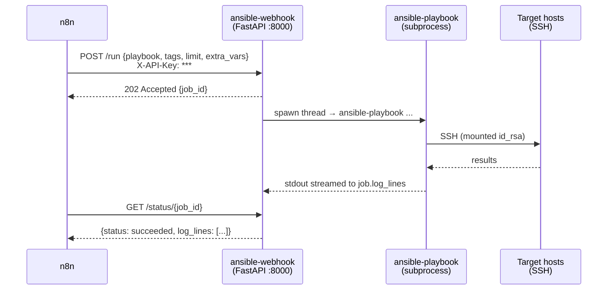
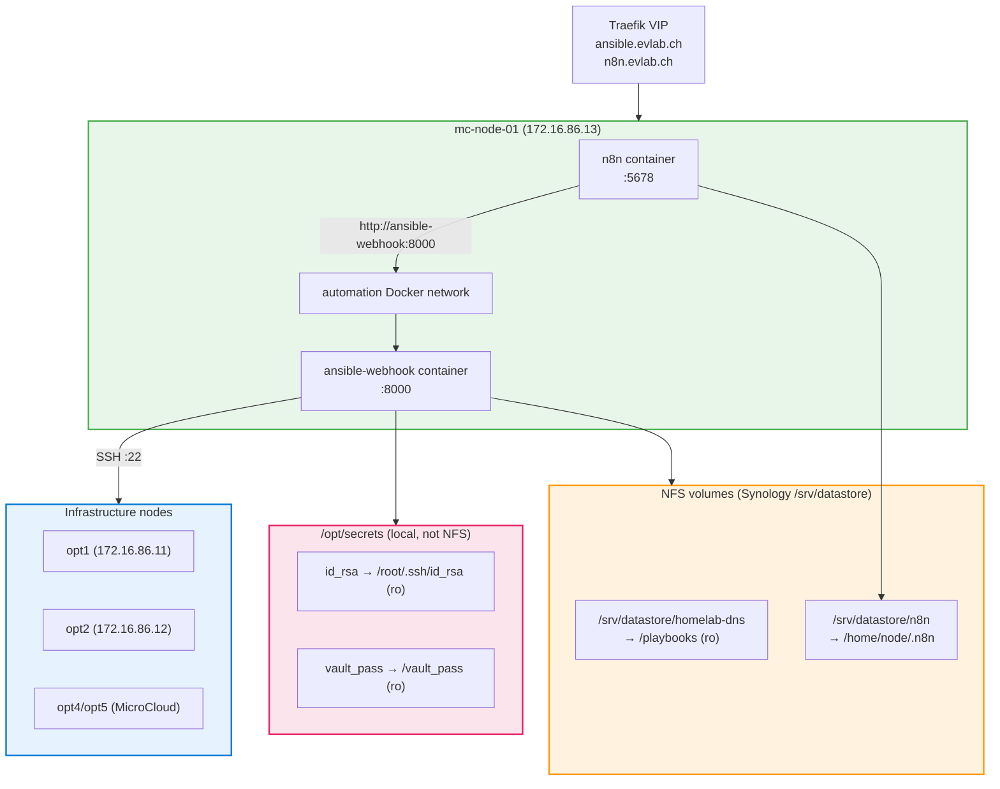

# ADR-015: Ansible Webhook Engine (FastAPI + Docker)

**Date:** 2026-03-08 | **Status:** ✅ Accepted

## Context

Ansible playbooks were executed exclusively from a developer's CLI, creating three problems:

1. **Silos** — infrastructure changes cannot be triggered by external events (monitoring alerts, GitHub webhooks, n8n workflows)
2. **No audit trail** — no centralized log of who ran what playbook when
3. **Blocking** — long-running playbooks (5–15 min) cannot be called synchronously from workflow tools without timeouts

n8n (`n8n.evlab.ch`) already runs on the Synology NAS and is the homelab's workflow automation hub. The goal is to let n8n trigger any Ansible playbook via HTTP POST without manual intervention.

## Decision

Deploy a **containerized FastAPI webhook service** (`ansible-webhook`) on the Synology NAS alongside n8n. It exposes four endpoints:

| Endpoint | Auth | Purpose |
|---|---|---|
| `GET /health` | None | Liveness probe |
| `GET /playbooks` | X-API-Key | List available playbooks |
| `POST /run` | X-API-Key | Accept job, return 202 + `job_id` |
| `GET /status/{job_id}` | X-API-Key | Poll job status + log tail |

The service runs `ansible-playbook` as a subprocess in a background thread, streams stdout to an in-memory job log, and exposes the result via `/status`.

## Architecture

## Deployment

## Security Model

- **API key** — `WEBHOOK_API_KEY` env var; compared with `X-API-Key` header via `secrets.compare_digest` (timing-safe)
- **Secrets** — SSH private key and Vault password mounted read-only; never baked into the image
- **Path traversal** — playbook names validated to be plain filenames (no `/` or `..`)
- **Network** — container joins `n8n_default` network; internal n8n calls need no Traefik hop
- **Watchtower** disabled — explicit image updates only

## Rationale

- **FastAPI** — async-native, built-in OpenAPI docs at `/docs`, type-safe via Pydantic
- **202 + polling** — Ansible playbooks run 5–15 minutes; synchronous HTTP would time out n8n. Asynchronous job model avoids this entirely
- **In-memory job store** — sufficient for homelab single-instance deployment; no Redis/database dependency
- **MicroCloud placement** — both n8n and ansible-webhook run on mc-node-01; internal Docker network for n8n→webhook calls with no Traefik hop
- **NFS for data volumes** — n8n workflow data and the playbook repo clone live on `/srv/datastore` (Synology NFS), ensuring persistence across container rebuilds and coverage by Synology backups
- **Secrets stay local** — SSH key and Vault password in `/opt/secrets` on mc-node-01 (not on NFS, not replicated)

## Alternatives Considered

- **Ansible Semaphore** — full UI + DB + RBAC; over-engineered for a single-operator homelab
- **AWX/Tower** — same concern; requires PostgreSQL, Redis, significant resource overhead
- **Direct n8n SSH Execute** — n8n has an SSH node but it blocks the workflow, no async, no audit log
- **Celery + Redis** — overkill for homelab; adds two services for the same result

## Consequences

- Repo must be cloned at `/srv/datastore/homelab-dns` on mc-node-01 (NFS-backed) — handled by `microcloud-services.yml` Phase 3
- SSH key (`id_rsa`) and Vault password must be placed at `/opt/secrets/` on mc-node-01 before first run
- `vault_n8n_encryption_key` and `vault_ansible_webhook_key` must be added to `group_vars/all/vault.yml`
- `ansible.evlab.ch` DNS record + Traefik service added for external access
- OpenAPI docs available at `https://ansible.evlab.ch/docs` (protected by API key)
