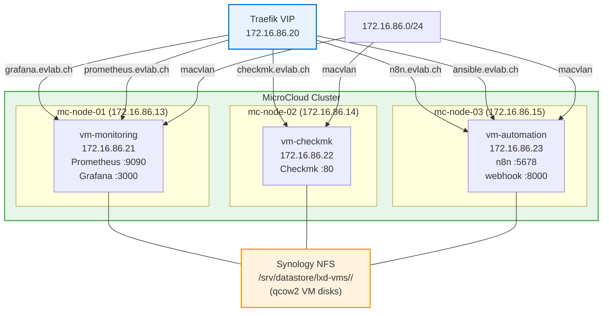

# ADR-017: LXD VMs Instead of Containers for MicroCloud Services

**Date:** 2026-03-09 | **Status:** ✅ Accepted

## Context

MicroCloud services (Prometheus, Grafana, Checkmk, n8n, ansible-webhook) were running as LXD **containers** on mc-node-01. Three persistent problems emerged:

1. **NFS UID remapping** — Synology NFS exports with UID 1024. LXD containers remap UIDs, causing permission failures on the shared NFS mount. Required ugly workarounds (`raw.idmap`, `security.nesting`).
2. **Port proxy devices** — containers share the host network stack, so exposing ports required explicit `proxy` devices for each service (e.g. `tcp:0.0.0.0:9090` → `tcp:127.0.0.1:9090`). More devices = more failure modes.
3. **Docker-in-container** — the automation container ran Docker inside LXD (required `security.nesting`). Nested container runtimes are fragile and add unnecessary complexity.

## Decision

Replace all LXD containers with **LXD VMs**. Each VM gets:
- Its own kernel
- Its own real LAN IP via macvlan on `enp0s31f6`
- Its own DHCP reservation and DNS name
- All services installed natively via apt/npm/uv (no Docker)
- VM disk stored as qcow2 on NFS via `dir` storage driver

| VM | IP | Node | Services |
|----|----|------|---------|
| vm-monitoring | 172.16.86.21 | mc-node-01 | Prometheus + Grafana |
| vm-checkmk | 172.16.86.22 | mc-node-02 | Checkmk Raw |
| vm-automation | 172.16.86.23 | mc-node-03 | n8n + ansible-webhook |

## Architecture

## Storage

VMs use LXD's `dir` storage driver pointing to per-node NFS subdirectories:
- `source=/srv/datastore/lxd-vms/mc-node-01` → vm-monitoring qcow2
- `source=/srv/datastore/lxd-vms/mc-node-02` → vm-checkmk qcow2
- `source=/srv/datastore/lxd-vms/mc-node-03` → vm-automation qcow2

Per-node subdirectories are required because all 3 nodes share the same NFS export — a single path would cause LXD to reject pool initialization ("source path isn't empty").

VMs use qcow2 disk images, which require no xattr support from the filesystem, making plain NFS (`dir` driver) sufficient.

## Networking

LXD profile `bridged-lan` uses `nictype=macvlan` on `enp0s31f6`. Each VM gets a unique MAC address (auto-generated by LXD), a DHCP reservation for a fixed IP, and static IP configured via netplan inside the VM (`dhcp4: false`, cloud-init default netplan removed).

VMs are directly reachable on the LAN — no port proxy devices needed on the host.

**Host-to-VM access**: macvlan isolation prevents the physical host from reaching its own VMs directly. A dedicated `macvlan-host` bridge interface (managed by systemd, see ADR-019) provides host↔VM connectivity using `/32` addresses and explicit host routes.

## Service Installation

| Service | Method |
|---------|--------|
| Prometheus | `apt install prometheus` |
| Grafana | Grafana APT repo + `apt install grafana` |
| Checkmk | `.deb` download + `omd create cmk` |
| n8n | Node.js 20 LTS + `npm install -g n8n` + systemd |
| ansible-webhook | `uv venv` + `uvicorn` + systemd |

## Alternatives Considered

- **Keep containers with `raw.idmap`** — works but fragile; UID mapping issues resurface on NFS export changes
- **Docker on bare metal (mc-node-01)** — avoids containers-within-VMs but loses cluster isolation
- **Move services to Synology** — violates ADR-009 (apps on Synology, not infra services)
- **Ceph storage** — would solve the NFS/xattr problem but violates ADR-005

## Consequences

- VMs take longer to start than containers (~30s vs ~2s) — acceptable for always-on services
- Each VM consumes ~4 GB RAM — total: 12 GB across 3 physical nodes (Optiplex Micro has 32 GB)
- DHCP reservations required after first boot (MAC captured via `lxc config get <vm> volatile.eth0.hwaddr`)
- `update.yml` should evacuate/restore VMs around MicroCloud node reboots (same as containers)
- ansible-webhook secrets (`id_rsa`, `vault_pass`) must be pushed manually into vm-automation
- macvlan-host networking uses /32 addresses (not /24) to avoid competing kernel routes — see ADR-019
