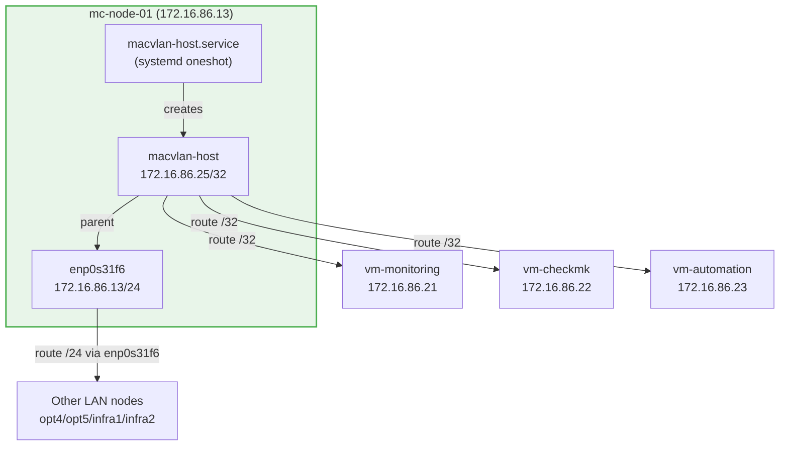

# ADR-019: macvlan-host Bridge via Systemd Service (Not Netplan)

**Date:** 2026-03-26 | **Status:** ✅ Accepted

## Context

LXD VMs use macvlan network interfaces attached to the physical NIC (`enp0s31f6`). A fundamental limitation of macvlan is that **the physical host cannot communicate with its own macvlan children** — traffic from the host to a VM's macvlan IP is dropped at the kernel level.

To allow the host to reach its LXD VMs (required for Ansible `lxc exec`, Checkmk agent polling, Prometheus scraping via macvlan IPs), a separate macvlan interface named `macvlan-host` must be created on the host, attached to the same parent NIC.

Two approaches exist:
1. **Netplan** — add a `macvlans` stanza to `/etc/netplan/01-mc.yaml`
2. **Systemd service** — create a one-shot service that runs `ip` commands at boot

## Problem With Netplan Approach

When netplan assigns a /24 address to `macvlan-host`, the kernel installs a route:
```
172.16.86.0/24 dev macvlan-host src 172.16.86.25
```
This route **shadows** the same-prefix route on `enp0s31f6`:
```
172.16.86.0/24 dev enp0s31f6 src 172.16.86.13
```
With two equal-metric routes for the same prefix, kernel route selection is non-deterministic. When `macvlan-host` wins, the host cannot reach other LAN nodes — including the LXD cluster peers on opt4/opt5 (ports 8443/dqlite). This causes `lxc cluster list` to fail with "no available dqlite leader server found" and the entire LXD cluster becomes non-operational.

## Decision

Manage `macvlan-host` via a **systemd one-shot service** using `/32` addresses and explicit per-VM host routes:

```ini
[Service]
Type=oneshot
RemainAfterExit=yes
ExecStart=/bin/bash -c 'ip link show macvlan-host &>/dev/null || ip link add macvlan-host link enp0s31f6 type macvlan mode bridge'
ExecStart=/sbin/ip addr flush dev macvlan-host
ExecStart=/sbin/ip addr add 172.16.86.25/32 dev macvlan-host
ExecStart=/sbin/ip link set macvlan-host up
ExecStart=/sbin/ip route replace 172.16.86.21/32 dev macvlan-host src 172.16.86.25
ExecStart=/sbin/ip route replace 172.16.86.22/32 dev macvlan-host src 172.16.86.25
ExecStart=/sbin/ip route replace 172.16.86.23/32 dev macvlan-host src 172.16.86.25
```

A `/32` address creates no subnet route — only the three explicit `/32` host routes for the VMs are added. All other LAN traffic continues to route via `enp0s31f6`.

The netplan template (`netplan-mc.yml.j2`) contains **no macvlan stanza** — macvlan-host is exclusively managed by this service.

## Architecture



## Alternatives Considered

- **Netplan /24** — Tried initially. Caused competing kernel route that broke LXD dqlite cluster quorum. Required full cluster recovery.
- **Netplan /32 with static routes** — Viable but netplan static routes require careful ordering and don't survive interface restarts as cleanly as systemd.
- **OVN bridge (microovn)** — MicroOVN provides br-int, but it's for east-west VM traffic, not host-to-VM access.
- **Port proxy devices** — LXD proxy devices forward specific ports but require per-port configuration and don't support ICMP.

## Consequences

- `macvlan-host.service` must be deployed and started before LXD VMs are accessible from the host.
- **Never assign /24 to macvlan-host** — /24 creates a competing kernel route that breaks LXD cluster connectivity.
- Ansible deploys this service via `--tags mc_macvlan_host` in `microcloud-services.yml`.
- After service restart, verify routing with: `ip route get 172.16.86.14` — must show `dev enp0s31f6`, not `dev macvlan-host`.
- Each MicroCloud node has its own macvlan-host IP: opt3=172.16.86.25, opt4=172.16.86.24, opt5=172.16.86.26 (defined in `group_vars/all/main.yml`).
