# Architecture Decision Records

15 key decisions made during the homelab DNS/HTTPS/VPN infrastructure project.

```mermaid
graph TD
    ADR001["ADR-001\nDedicated Optiplex\nfor Infrastructure"]
    ADR002["ADR-002\nTechnitium DNS\nin Docker"]
    ADR003["ADR-003\nWireGuard Native\n(not Docker)"]
    ADR004["ADR-004\nTraefik HA via\nkeepalived"]
    ADR005["ADR-005\nNFS from Synology\n(not Ceph)"]
    ADR006["ADR-006\nSplit-scope DHCP\n(not failover)"]
    ADR007["ADR-007\nDNS-01 Challenge\nvia Infomaniak"]
    ADR008["ADR-008\nDual Monitoring\nStack"]
    ADR009["ADR-009\nApps Stay on\nSynology"]
    ADR010["ADR-010\nMkDocs + GitHub\nPages"]
    ADR011["ADR-011\nMermaid Diagram\nStandard"]
    ADR012["ADR-012\nuv Python\nTooling"]
    ADR013["ADR-013\nClaude API\nAnsible Tooling"]
    ADR014["ADR-014\nSeparate OS + Container\nPatch Playbooks"]
    ADR015["ADR-015\nAnsible Webhook\nEngine"]

    INFRA["Infrastructure\nLayer"]
    NET["Network\nServices"]
    MON["Observability"]
    STORE["Storage &\nApps"]
    TOOLING["Dev Tooling &\nDocumentation"]
    OPS["Operations"]

    INFRA --> ADR001
    NET --> ADR002 & ADR003 & ADR004 & ADR006 & ADR007
    MON --> ADR008
    STORE --> ADR005 & ADR009
    TOOLING --> ADR010 & ADR011 & ADR012 & ADR013
    OPS --> ADR014 & ADR015

    style INFRA fill:#e6f3ff,stroke:#0078D4,stroke-width:2px
    style NET fill:#e8f5e9,stroke:#4caf50,stroke-width:2px
    style MON fill:#fff3e0,stroke:#ff9800,stroke-width:2px
    style STORE fill:#fce4ec,stroke:#e91e63,stroke-width:2px
    style TOOLING fill:#f3e5f5,stroke:#9c27b0,stroke-width:2px
    style OPS fill:#e0f7fa,stroke:#00bcd4,stroke-width:2px
```

| ADR | Title | Status |
|-----|-------|--------|
| [ADR-001](adr-001-dedicated-optiplex.md) | Dedicated Optiplex Micro for Infrastructure | ✅ Accepted |
| [ADR-002](adr-002-technitium-docker.md) | Technitium DNS in Docker | ✅ Accepted |
| [ADR-003](adr-003-wireguard-native.md) | WireGuard Native (not Docker) | ✅ Accepted |
| [ADR-004](adr-004-traefik-keepalived.md) | Traefik HA via keepalived | ✅ Accepted |
| [ADR-005](adr-005-nfs-synology.md) | NFS from Synology (not Ceph) | ✅ Accepted |
| [ADR-006](adr-006-split-scope-dhcp.md) | Split-scope DHCP | ✅ Accepted |
| [ADR-007](adr-007-dns01-infomaniak.md) | DNS-01 Challenge via Infomaniak | ✅ Accepted |
| [ADR-008](adr-008-dual-monitoring.md) | Dual Monitoring Stack | ✅ Accepted |
| [ADR-009](adr-009-apps-on-synology.md) | Application Services Stay on Synology | ✅ Accepted |
| [ADR-010](adr-010-mkdocs-github-pages.md) | MkDocs + GitHub Pages for Documentation | ✅ Accepted |
| [ADR-011](adr-011-mermaid-diagrams.md) | Mermaid as Documentation Diagram Standard | ✅ Accepted |
| [ADR-012](adr-012-uv-python-tooling.md) | uv for Python Tooling Scripts | ✅ Accepted |
| [ADR-013](adr-013-claude-api-ansible-tooling.md) | Claude API for Ansible AI Tooling | ✅ Accepted |
| [ADR-014](adr-014-patch-management-playbooks.md) | Separate OS and Container Patch Management Playbooks | ✅ Accepted |
| [ADR-015](adr-015-ansible-webhook-engine.md) | Ansible Webhook Engine (FastAPI + Docker) | ✅ Accepted |
