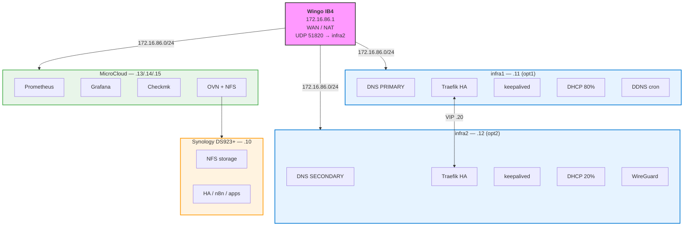

# homelab-dns

Ansible-automated homelab infrastructure on 5 Dell Optiplex Micro machines: HA DNS, HTTPS reverse proxy with wildcard certs, WireGuard VPN, DHCP, ad blocking, and full monitoring stack.

## Architecture



## Quick Start

```bash
# Prerequisites
brew install ansible
ssh-copy-id fjacquet@172.16.86.{11,12,13,14,15}

# Configure secrets
echo 'your-vault-password' > ~/.vault_pass && chmod 600 ~/.vault_pass
ansible-vault edit group_vars/all/vault.yml

# Deploy infrastructure (infra1 + infra2)
ansible-playbook -i inventory.yml site.yml

# Deploy MicroCloud nodes
ansible-playbook -i inventory.yml microcloud-prepare.yml
ssh fjacquet@172.16.86.13 "sudo microcloud init"  # interactive
ansible-playbook -i inventory.yml microcloud-services.yml
```

## Key Design Decisions

- **No Ceph** — NFS from Synology for MicroCloud storage (simple, sufficient for homelab)
- **WireGuard native** — kernel module, not Docker (simpler, more reliable)
- **Technitium in Docker** — no .deb package available, `network_mode: host` for DHCP broadcast
- **keepalived VIP** — sub-10s failover vs DNS round-robin (minutes)
- **Dual monitoring** — Prometheus/Grafana (metrics) + Checkmk (SNMP, auto-discovery, alerting)

See [Architecture Decision Records](adr/index.md) for full rationale.
